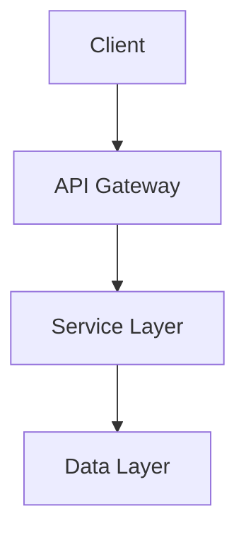

# Design Notes

This document serves as a **scratchpad for evolving ideas** and system design exploration. Use this space to iterate on designs, explore alternatives, and develop concepts until they mature.

## Design Evolution Workflow

**This document is for iteration and exploration:**

- Draft initial ideas and alternatives here
- Iterate on designs with examples and diagrams
- Explore trade-offs and different approaches

**When designs mature, graduate them to DECISIONS.md:**

- Move finalized designs to DECISIONS.md with full rationale
- Include decision context, trade-offs, and implementation details
- Leave a breadcrumb here pointing to the final decision

**Example breadcrumb:**

```markdown
## ~~Challenge Data Model~~ → [DECISIONS.md](./DECISIONS.md#challenge-data-model-v1)

Initial design was drafted here and promoted to DECISIONS.md when sufficiently mature.
```

## Goals & Requirements

### Core Goals

- [ ] Goal 1: Clear, measurable objective
- [ ] Goal 2: Another objective
- [ ] Goal 3: Third objective

### Requirements

- [ ] Functional requirement 1
- [ ] Functional requirement 2
- [ ] Non-functional requirement 1 (performance, security, etc.)

## System Architecture

### High-Level Overview

[Describe the overall system architecture here]



## Data Models

### Core Entities

#### Entity Example

**Purpose**: Brief description of what this entity represents and why it exists.

**Schema Structure**:

```yaml
# Human-readable authoring format
user:
  id: string # Unique identifier
  email: string # User's email address
  profile:
    name: string # Display name
    avatar: string? # Optional profile image URL
  settings:
    theme: light | dark
    notifications: boolean
  createdAt: timestamp
  updatedAt: timestamp
```

**JSON Runtime Format**:

```json
{
  "id": "usr_123456",
  "email": "user@example.com",
  "profile": {
    "name": "John Doe",
    "avatar": "https://example.com/avatar.jpg"
  },
  "settings": {
    "theme": "dark",
    "notifications": true
  },
  "createdAt": "2024-01-15T10:30:00Z",
  "updatedAt": "2024-01-15T10:30:00Z"
}
```

**Usage Examples**:

_Basic Usage_:

```yaml
# Simple user creation
user:
  email: "new@example.com"
  profile:
    name: "New User"
  settings:
    theme: "light"
    notifications: true
```

_Advanced Usage_:

```yaml
# User with complex profile and relationships
user:
  email: "admin@example.com"
  profile:
    name: "Admin User"
    avatar: "https://cdn.example.com/admin-avatar.jpg"
    bio: "System administrator with 5+ years experience"
  settings:
    theme: "dark"
    notifications: false
    advanced_features: true
  roles:
    - admin
    - moderator
  permissions:
    - user_management
    - system_configuration
```

### Relationships

```mermaid
classDiagram
    class User {
        +String id
        +String email
        +Profile profile
        +Settings settings
        +DateTime createdAt
        +DateTime updatedAt
    }

    class Profile {
        +String name
        +String avatar
        +String bio
    }

    class Settings {
        +Theme theme
        +Boolean notifications
        +Boolean advancedFeatures
    }

    User ||--|| Profile : has
    User ||--|| Settings : has
```

## API Design

### Core Patterns

**RESTful Endpoints**:

```
GET    /api/users          - List users
POST   /api/users          - Create user
GET    /api/users/{id}     - Get specific user
PUT    /api/users/{id}     - Update user
DELETE /api/users/{id}     - Delete user
```

**Request/Response Examples**:

```typescript
// GET /api/users/123
interface UserResponse {
  data: User;
  meta: {
    timestamp: string;
    version: string;
  };
}

// POST /api/users
interface CreateUserRequest {
  email: string;
  profile: {
    name: string;
  };
  settings?: Partial<Settings>;
}
```

## Design Patterns

### Pattern 1: [Name]

**Purpose**: What problem does this pattern solve?

**Implementation**:

```typescript
// Code example showing the pattern
class ExamplePattern {
  // Implementation details
}
```

**Usage Guidelines**:

- When to use this pattern
- When NOT to use this pattern
- Common pitfalls to avoid

## Performance Considerations

### Caching Strategy

- [ ] Cache layer 1: Description
- [ ] Cache layer 2: Description

### Database Optimization

- [ ] Index strategy
- [ ] Query optimization patterns

## Security Model

### Authentication

- [ ] Auth method 1
- [ ] Auth method 2

### Authorization

- [ ] Permission model
- [ ] Role-based access control

## Related Documentation

- [DECISIONS.md](./DECISIONS.md) - Architecture decisions that shaped this design
- [GUIDELINES.md](./GUIDELINES.md) - Implementation guidelines for these patterns
- [TODOs.md](./TODOs.md) - Planned improvements and extensions
